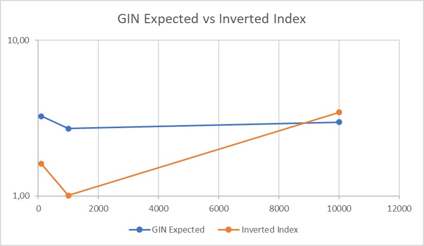
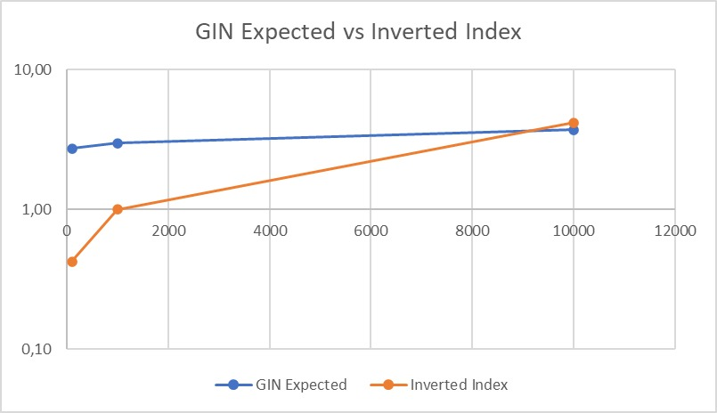

### BD2 - Grupo 4

**_Integrantes:_**

- Salazar Alva, Rodrigo Gabriel
- Sara Junco, Juan Sebastian 
- Ponce Contreras, Luis Eduardo
- Lapa Carhuamaca, Arleth Ivhy

*CUADRO DE ACTIVIDADES*
| Rodrigo Salazar       | Implementación SPIMI               |
| Juan Sara             | Implementación GIN index           |
| Luis Ponce            | Implementación Frontend y Cloud    |
| Arleth Lapa           | Implementacion de Índice Invertido |

---
# Proyecto 2 | Recuperación de Documentos de Texto

### Configuración 

Antes de ejecutar el programa, es necesario descargar la base de datos de kaggle (https://www.kaggle.com/datasets/Cornell-University/arxiv), descomprimirla y colocar el archivo _json_ en: *app/data/arxiv-metadata-oai-snapshot.json*

Para ejecutar el programa ingresar a la carpeta _app_ y ejecutar el comando:
```
python3 app.py
```
El app puede ejecutarse con 100, 1 000 o 10 000 papers. Para seleccionar que opción se desea utilizar, modificar el valor de NUMBER_ENTRIES_OPTION en *app/app.py (0:100, 1:1000, 2:0000)*.

## Descripción del dominio de datos


La fuente de datos del presente proyecto es un repositorio de la página de _Kaggle_ cuyo dominio de datos son _papers académicos_. Donde cada registro contiene 10 campos, los cuales son:

- ID: Id del _paper_
- SUBMITTER: Quien envió el trabajo
- AUTHORS: Autores del artículo
- TITLE: Título del trabajo
- COMMENTS: Información adicional
- JOURNAL: Informacion sobre la revista en la que se publicó el _paper_
- DOI: Digital Object Identifier
- ABSTRACT: Resumen del _paper_
- CATEGORIES: Categoría a la cual pertenece
- VERSIONS: Historial de versiones

Nótese como la mayoría de estos atributos son de longitud variable, por lo que el tipo de _querys_ que se realizarán son de recuperación de información, en las que se buscará extraer los _k elementos_ cuyo contenido sea más similar al de una _query_ proveída en lenguaje natural.

## Introducción

La recuperación de documentos de texto basadas en el contenido es uno de los campos más estudiados en el área de base de datos, por ende, en el presente trabajo se tiene como objetivo entender y aplicar los algoritmos de búsqueda y recuperación, por lo que, este proyecto está enfocado en la construcción de un índice invertido para la realización de este tipo de tareas. Asimismo, se desarrollará una interfaz gráfica para poder comparar dichos resultados de Python con PostgreSQL y analizar los tiempos de recuperación. Cabe resaltar, que la data que se usará será de un repositorio de la página Kaggle que tiene como temática los papers.

El siguiente informe se basará en dos aspectos. En primer lugar, se implementará el Índice Invertido utilizando un modelo de recuperación basado en ranking para consultas de texto libre. En adición, el scoring se debe de aplicar todo en memoria secundaria, por ende se usará el algoritmo de Single-pass in-memory indexing (SPIMI) para el cálculo de la similitud de coseno. En segundo lugar, se utilizará el índice GIN para poder ejecutar las consultas en PostgreSQL y de esa forma poder realizar un análisis, discusión y comparación de los resultados.

## Backend
Se ha construido un índice invertido óptimo para la busqueda y recuperación de _papers_  por ranking (top k) para consultas de texto libre.
### Construcción del índice invertido
#### Preprocesamiento
*Filtrado de stopwords*
La librería _nltk_ crea los _stopwords_ en inglés, debido a la data se encuentra en ese idioma.
```
nltk.download('stopwords')
nltk.download('punkt')
stoplist = stopwords.words("english")
stoplist += ['?','.',',','»','«','â','ã','>','<','(',')','º','u']
```
*Reducción de palabras (Stemming)*
La librería _SnowballStemmer_ obtiene las raíces de las palabras de nuestra _data_, las cuales se usan para el proceso de tokenización.
```
stemmer = SnowballStemmer('english')
stem_token = stemmer.stem(word)
```
*Toquenizacion*
Se implementó una función que realiza la limpieza del texto, la cual removerá caracteres principales y urls.
```
def  clean_text(self, text):
	text = self.remove_special_character(text)
	text = self.remove_punctuation(text)
	text = self.remove_url(text)
	text = nltk.word_tokenize(text)
	return  text
```
- remove_punctuation -> Remueve la puntuacion
- remove_url -> Remueve las URL's
-  remove_special_character -> Remueve caracteres especiales
-  clean_text -> Se encarga de tokenizar las palabras del texto

El proceso para la obtención de los tokens es aplicar la función de limpieza y guardar el texto en *text_tokenized*, luego recorrer todas las palabras del texto de los _papers_ y obtener sus raíces, finalmente insertarlos en la lista *block_dict[]*.
```
# Extract text from paper
text = self.extract_text_paper(paper_id,paper)
text_tokenized = self.clean_text(text)

# Tokenize text
for  word  in  text_tokenized:
	if  word  not  in  stoplist:
		stem_token = stemmer.stem(word)
		# Insert into posting list
		if  stem_token  in  block_dict:
			# Add 1 to count
			if  paper_id  in  block_dict[stem_token]:
				block_dict[stem_token][paper_id] += 1
			else:
				block_dict[stem_token][paper_id] = 1
		else:
			block_dict[stem_token] = {}
			block_dict[stem_token][paper_id] = 1
```

#### Construcción del índice

Para la construcción del índice invertido se tiene como base principal una clase a la cual denominaremos "InvertedIndex". En dicha clase, se ha distribuido en distintas funciones los pasos para la construcción de este índice.  

La función "create_inverted_index" contiene la estructura del índice invertido para guardar los pesos TF-IDF, además que esta función incluye la construcción del índice en memoria secundaria el cual utiliza el algoritmo de *Single-pass in-memory indexing (SPIMI)*. Este algoritmo realiza la construcción del índice en memoria secundaria, debido a que este algoritmo es óptimo para el manejo de una gran colección de datos que contiene nuestra _data_. Este genera diccionarios (Hash) separados para cada bloque, sin necesidad de mantener el mapeo *<termino - IdTermino>* entre los bloques, además, esta no se debe de ordenar, sino acumular en el hash las publicaciones en listas a medida que van ocurriendo y al final se debe de ejecutar un merge en un "Big Index".

#### Consulta
Se recibe una consulta ingresada por el usuario, esta es una frase en lenguaje natural, para obtener los resultados de dicha consulta se implementó la función *compare_query(query)*, la cual realiza el siguiente procedimiento:
-   Limpia la _query_ en lenguaje natural
-   Calcula el _td_ e _idf_
-   Halla la frecuencia de cada palabra en el _query_
-   Si la palabra esta en un indice invertido, se calcula el indice invertido
-   Obtiene el *tf-idf* del _query_

Al final, se ordena la lista de cosenos obtenidos, donde se guarda el *paper_id** del documento, la similitud respectiva y un arreglo de _papers_ de mayor a menor por el que tenga mayor similitud .
```
similarity = []
for  paper_id  in  papers_data:
	data_pos = self.search_header_database(paper_id.encode('ascii'))
	data = self.extract_header_database(data_pos)
	papers_data[paper_id]["norm"] = data[3]
	papers_data[paper_id]["cos"] = papers_data[paper_id]["cos"] / (norma_query * papers_data[paper_id]["norm"])
	similarity.append( {"paper":paper_id,"similarity":papers_data[paper_id]["cos"]} )
```
En el apartado de Ejecución óptima de las consultas se describe a mayor detalle la implementación del código para lograr resultado con los _k papers_ más similares.

### Manejo de memoria secundaria

Para poder garantizar la escalabilidad de la base de datos indexada, se ha unido el algoritmo mencionado en la sección previa con el algoritmo de *SPIMI*.

Para ello, se maneja con cuatro archivos principales:

- database_data.bin : Archivo de texto de longitud variable. Contiene la data de cada paper

- database_head0.bin : Archivo binario que sirve como cabecera para database_data.bin, garantizando acceso en _O(1)_ y búsqueda en _O(log n)_

- indice_invertido0.json : Archivo de texto de Índice Invertido. Contiene la data asociada a cada palabra

- indice_head.bin: Archivo binario que sirve como cabecera para indice_invertido0.json, garantizando acceso en _O(1)_ y búsqueda en _O(log n)_

  

Entonces, primero construimos nuestros archivos _database_ utilizando usando buckets de _head_ y un _mergesort_. Cada entrada en el archivo header contiene *(paper_id, pos_data, pos_len, norm)*. Donde _norm_ es inicializado en _0.0_ y será usado como el valor sobre el cual debemos dividir el _coseno_ calculado con dicho documento para normalizar.

Se presenta el algoritmo simplificado para crear la database:
```
# CREATE DATABASE
block_header = []
headerfile_id = 0
for jsonpaper in datastream:
    saved = False
    paper = read_jsonpaper(jsonpaper)
    data_pos, data_len = save_paper_database(paper_data_entry)
    block_header.append( (paper.id, data_pos, data_len, 0.0) )

    if memory_usage > max_memory_usage:
        save_header_database(block_header, headerfile_id)
        block_header = []
        headerfile_id += 1
        saved = True
    
    paper_count += 1
if not saved:
    print("INFO: Saving last block")
    save_header_database(block_header, headerfile_id)
    headerfile_id += 1

# MERGE HEADERS
number_headerfiles = headerfile_id-1
while (number_headerfiles != 0):    # While more than 1 header
    tmpfile_id = 0
    for i in range(0,number_headerfiles+1, 2):
        if (number_headerfiles >= i+1):
            # Merge and & i+1
            block_a = read_headerfile(i)
            block_b = read_headerfile(i+1)
            tmpfile_id = int(i/2) 
            # Select in order
            while (block_a && block_b)):
                if entry_a[0] < entry_b[0]:
                    save_merge_header(tmpfile_id, block_a.entry)
                    block_a.next_entry()
                else:
                    save_merge_header(tmpfile_id, block_b.entry)
                    block_b.next_entry()
            # Iterate remanining
            while (block_a):
                save_merge_header(tmpfile_id, block_a.entry)
                block_a.next_entry()
            while (valid_b):
                save_merge_header(tmpfile_id, block_b.entry)
                block_b.next_entry()
            remove_headerfile(i)
            remove_headerfile(i+1)
            rename_headertmpfile(tmpfile_id)
        else:
            # Skip lonely file
            tmpfile_id+=1
            rename_headerfile(i, tmpfile_id)
    # Update number of files
    number_headerfiles = tmpfile_id
```

Posteriormente, con la _database_ creamos el índice usando el algoritmo de la sección previa. Este a sido fusionado con _SPIMI_. De esta forma, en vez de guardar un diccionario de *listas {word:docID_list}*, se guarda un diccionario de diccionario de repeticiones *{word:{docID:count}}*. El algoritmo simplificado para realizar esta operación se muestra a continuación:
```
# CREAR INDICE PRELIMINAR

# SPIMI INVERT
# Init block dict
block_dict = {}
indexfile_id = 0
for paper in database:
    saved = False
    # Extract text from paper
    text = self.extract_text_paper(paper_id,paper)
    text_tokenized = self.clean_text(text)
    # Tokenize text
    for word in text_tokenized:
        if word not in stoplist:
            stem_token = stemmer.stem(word)
            # Insert into posting list
            if stem_token in block_dict:
                # Add 1 to count
                if paper_id in block_dict[stem_token]:
                    block_dict[stem_token][paper_id] += 1
                else:
                    block_dict[stem_token][paper_id] = 1
            else:
                block_dict[stem_token] = {}
                block_dict[stem_token][paper_id] = 1
    if memory_usage > max_memory_usage:
        # Save block dict
        save_block_dict(block_dict, indexfile_id)
        block_dict = {}
        indexfile_id += 1
        saved = True
# If last block not saved, save
if not saved:
    save_block_dict(block_dict, indexfile_id)
    indexfile_id += 1


# SPIMI MERGE
number_indexfiles = indexfile_id-1
merge_step = 2

while (number_indexfiles!=0): # While more than 1 file
    tmpfile_id = 0
    for i in range(0,number_indexfiles+1, merge_step):
        if (number_indexfiles >= i+1):
            block_a = self.read_indexfile(i)
            block_b = self.read_indexfile(i+1)
            tmpfile_id = int(i/2) 
            while (True):
                word_a = block_a.word
                word_b = block_a.word
                if word_a == word_b:
                    # If word is the same, merge
                    word_block_next = block_a
                    for paper_id in block_a[word_a]:
                        t =  block_a[word_a][paper_id]
                        if paper_id in word_block_next[word_a]:
                            word_block_next[word_a][paper_id] += t
                        else:
                            word_block_next[word_a][paper_id] =  t
                    save_merge_dict(tmpfile_id, word_block_next)
                    word_a.next_entry()
                    word_b.next_entry()
                else:
                    # If different, add in order
                    if word_a < word_b:
                        save_merge_dict(tmpfile_id, block_a)
                        block_a.next_entry()
                    else:
                        self.save_merge_dict(tmpfile_id, block_b)
                        block_b.next_entry()
            # Iterate remanining
            while (block_a):
                save_merge_dict(tmpfile_id, block_a)
                block_a.next_entry()
            while (valid_b):
                self.save_merge_dict(tmpfile_id, block_b)
                block_b.next_entry()

            # Overwrite old files
            remove_indexfile(i)
            remove_indexfile(i+1)
            rename_tmpfile(tmpfile_id)
        else:
            # Skip lonely file
            tmpfile_id+=1
            rename_indexfile(i, tmpfile_id)

    # Update number of files
    number_indexfiles = tmpfile_id
```

El archivo preliminar obtenido de hacer el _InvertSPIMI_ y _MergeSPIMI_ luego se itera secuencialmente para convertir los diccionarios _{word:{docID:count}}_ en diccionarios de _{word:{docID:TF-IDF}}_ y calcular la norma de los documentos (actualizando en el header). Adicionalmente, cada vez que se agrega una entrada al indice final, se guarda tambien su posicion y longitud en _indice_head.bin_ usando la palabra como llave.El algoritmo simplificado para realizar esta operación se muestra a continuación.

```
move_indexfile_to_tmpfile()
base_index = read_tmpfile(0)
word_block = base_index.entry
while (base_index):
    word = word_block.word
    # Calculate IDF
    IDF = math.log( paper_count / len(word_block.papers))
    # Calculate TF*IDF
    for id_paper in word_block.papers:
        TF = 1+math.log(word_block.papers[id_paper])
        word_block.papers[id_paper] = TF*IDF
        # Update norm in header
        data_pos = search_header_database(id_paper)
        data = extract_header_database(data_pos)
        data.norm += data.norm + (TF*IDF)**2
        update_header_database(data, data_pos)
    # Total Block
    index_word_block = {word:{"papers":word_block[word],"IDF":IDF}}
    # Write to temp
    save_calc_dict(index_word_block)
    #Next
    base_index.next_entry()
# UPDATE NORM TO SQRT
sqrt_header_norm_database()
# REMOVE TMPFILE
remove_tmpfile(0)
```

### Ejecuccion Optima de consultas

Las consultas se ejecutan de forma óptima utilizando el índice invertido construido con los pasos previamente explicados.

Para ello, primero se construye un diccionario de conteo de palabras de la query dada como entrada. Con dicho diccionario se itera sobre cada una de sus palabras: se busca en el índice invertido. Si esta existe, se extrae el _IDF_ para calcular el _TFIDF_ del término para la _query_, y para cada documento que aparece en el índice con ese término, se calcula su producto, agregandolos a un diccionario de papers (agregando el paper si no está, o sumando el valor calculado si ya existe). En paralelo, se obtiene la *norm* de la query.

Con el diccionario de producto coseno por paper, éste se normaliza usando la norm de la query calculada y la norm del paper, extraído de *database_head0.bin* en *O(log n)* por búsqueda binaria. El valor normalizado se inserta a un heap de los k mas similares. El resultado es un arreglo con los *k papers* más similares.
```
index_query = {}

# CONTEO DE TOKENS
for word in query:
    word = clean(word)
    if word not in stoplist:
        tokenq = stemmer.stem(word)
        if tokenq not in index_query:
            index_query[tokenq] = 1
        else:
            index_query[tokenq] += 1

# CALCULO DE TF.IDF de la QUERY y PROD COSENO
norma_query = 0
papers_data = {}
for tokenq in index_query:
    entry = find_entry_in_index(tokenq)
    if entry:
        TF = 1+math.log(index_query[tokenq])
        IDF = entry["IDF"]
        TFIDF = TF*IDF
        norma_query += (TFIDF) ** 2
        for paper_id in entry["papers"]:
            cosine_pq = TFIDF * entry["papers"][paper_id]
            if paper_id in papers_data:
                papers_data[paper_id]["cos"] += cosine_pq
            else:
                papers_data[paper_id] = {}
                papers_data[paper_id]["cos"] = cosine_pq
norma_query = math.sqrt(norma_query)

# Normalizar con filtro de KNN
similarity = []
for paper_id in papers_data:
    # Calculate Cosine Norm
    data_pos = search_header_database(paper_id.encode('ascii'))
    data = extract_header_database(data_pos)
    papers_data[paper_id]["norm"] = data.norm
    papers_data[paper_id]["cos"] = papers_data[paper_id]["cos"] / (norma_query * papers_data[paper_id]["norm"])
    sim = papers_data[paper_id]["cos"]
    # KNN with heap
    if len(similarity) < k:
        heapq.heappush(similarity, (sim, paper_id))
    else:
        current_max = similarity[0]
        if current_max[0] < sim:
            heapq.heappop(similarity)
            heapq.heappush(similarity, (sim, paper_id))
```


## Frontend

### Diseño del índice con PostgresSQL

PostgresSQL cuenta con GIN, el cual significa Índice Invertido Generalizado. GIN maneja los elementos que podrían ser documentos y las consultas podrían ser búsquedas de documentos que contengan palabras específicas, por lo cual se implementó un "GIN_index" para poder realizar la comparación de tiempos de nuestra implementación y la de _postgresSQL_.

*GIN_index* es una clase que contiene la estructura del índice invertido, las funciones principales que son parte de la implementación son las siguientes:
- create_index
- stored_method_extend_table
- query_knn_table

Se realizó las siguientes consultas para procesar la _query_ para que posteriormente se cree el índice invertido:
```
DO $$
BEGIN
IF NOT EXISTS (	SELECT column_name
				FROM information_schema.columns
				WHERE table_schema = 'public'
				AND table_name = '{table}'
				AND column_name = 'search_txt') THEN
	ALTER TABLE {table} ADD COLUMN search_txt tsvector;
	UPDATE {table} SET search_txt = setweight(to_tsvector('english', id), 'A') || setweight(to_tsvector('english', title), 'B') || setweight(to_tsvector('english', categories), 'C');
END IF;
END
```
```
SELECT id, authors, abstract, categories, title, ts_rank_cd(search_txt, query) AS similarity
FROM {table}, to_tsquery('english', '{query}') query
where query @@ search_txt
order by similarity desc
limit {k};
```
Luego se valida recorriendo las tablas y se crea el índice invertido generalizado.
```
#Postgressql
CREATE INDEX 
IF NOT EXISTS paper_search_{table} ON {table} USING GIN (search_txt);

#Python
def  create_GIN_index(self,tables):
	for  table  in  tables:
		print("Validating GIN index for table {table}".format(table=table))
		self.stored_method_extend_table(table)
		self.create_index(table)
```
### Análisis comparativo con su propia implementación

Se realizó la experimentación de nuestra implementación, las pruebas se ejecutaron con _database_ de 100, 1 000 y 10 000 _papers_, y _querys_ generadas aleatoriamente con palabras que se encontraron en nuestro índice invertido. Asimismo, el tiempo de ejecución de las consultas con *GIN index* en _postgresSQL_ no incluye el tiempo de comunicación entre la base de datos remota, dado que la velocidad y conexión de internet también influyen en ese resultado.

>*QUERY 1*: fly me to the moon 
>*Top K*: 5




>*QUERY 2*: lost in a wormhole
>*Top K*: 5



>*QUERY 3*: finding a loophole in the law
>*Top K*: 5


Como se obserar en las graficas correspondientes a las pruebas realizadas, los tiempos de ejecuccion de GIN y nuestra implementacion de indice invertido son comparables en tiempo: se encuentran aproximadamente dentro del mismo orden de magnitud para todos los casos.

Cabe destacar que en terminos generales, el indice invertido tiene una mejor eficiencia que GIN para los valores mas pequeños de datos. Sin embargo, con el tamaño de base de datos mas grande, GIN tiene mejor eficiencia. En este sentido, este comportamiento se atribuye a las siguientes razones:

1) La complejidad de extraccion de los topK en el IndiceInvertido no depende solo del tamaño de la base de datos, sino que tambien del numero de coincidencia entre la query y los documentos. En este sentido, una diferencial importante entre nuestra implementacion y la de postgres es el preprocesamiento y extraccion de tokens: nuestra tokenizacion es mas perdonadora generando una mayor cobertura. Esto se puede ver en consultas donde, pese a usar la misma query, el IndiceInvertido devuelve documentos con baja similitud mientras que postgres simplemente no devuelve nada. Esto hace que el IndiceInvertido tenga que procesar un mayor numero de documentos al resolver la consulta, haciendo que la complejidad crezca mas rapido.

2) Postgres es un gestor de base de datos centrado en "relaibility" con lo que tiene componentes que crean overhead a la resolucion de la consulta. Esto le da una ventaja a nuestra implementacion.


Sin embargo, tambien es important considerar que el analisis realizado corresponde a los resultados del EXPLAIN ANALYZE de Postgres, los cuales son predicciones y no el tiempo que tomo realmente. Mas aun, al correr en un servidor, se espera que la instancia de postgres tenga un mejor poder de procesamiento.

No obstante, la conclusion final es la misma: las implementaciones tiene tiempos de ejecuccion comparables. El indice invertido tiene el potencial de tener una mejor eficiencia que la implementacion de GIN de postgres siempre y cuando se use el mismo metodo de tokenizacion dado a que esta diferencial tiene un impacto significativo en el tiempo de ejecucion a medida que el numero de documentos incremnta.

### GUI

Se realizó la implementación de una interfaz gráfica para que el usuario pueda interactuar con las funciones de búsqueda y recuperación de _papers_. Es intiutiva y amigable para el usuario, recoge la consulta y solicita que ingrese el _top k_, que es la cantidad de documentos a recuperar según la mayor similitud de su consulta.


Asimismo, se añadió los resultados que se obtienen de _postgresql_, para poder visualizar el uso de _GIN_ y comparar la eficiencia de nuestra implementación.


